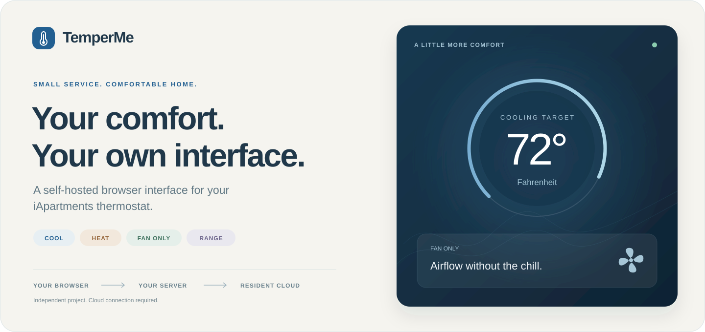
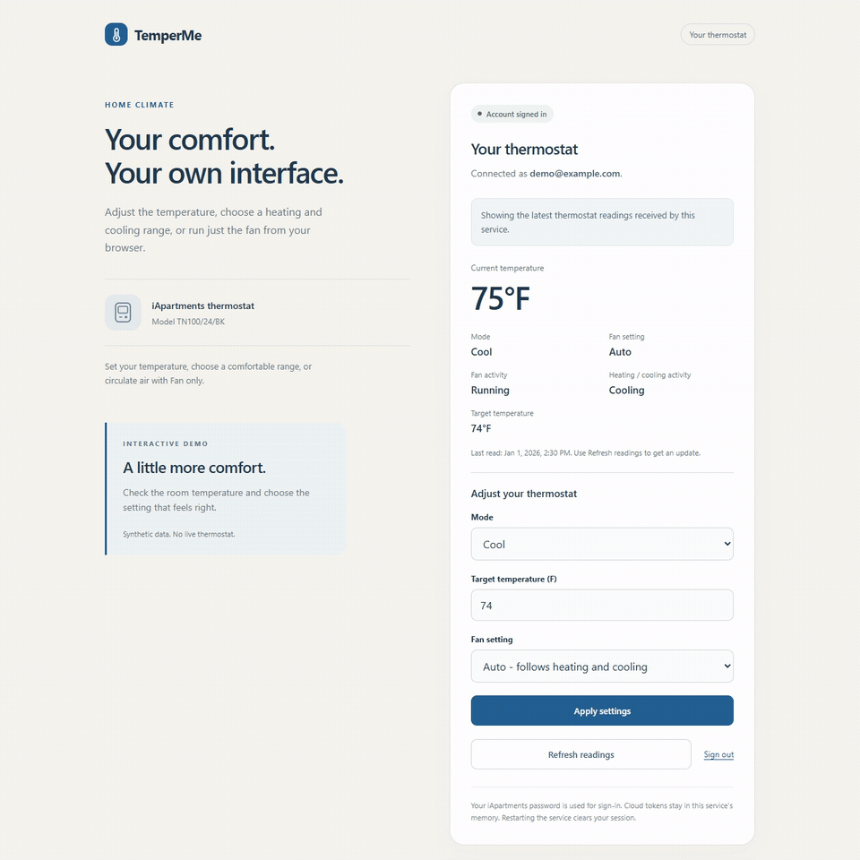
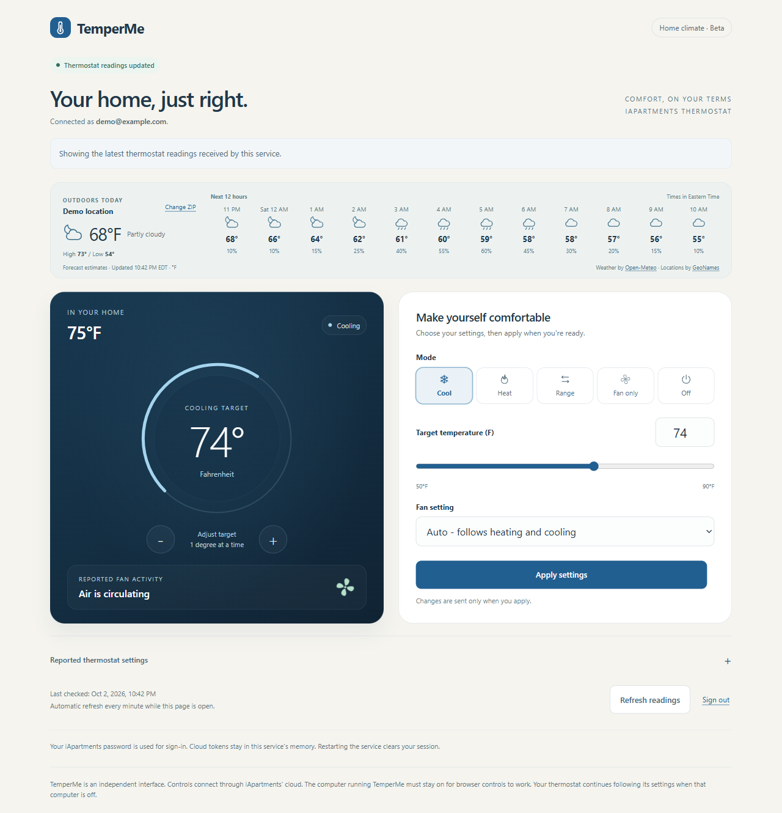
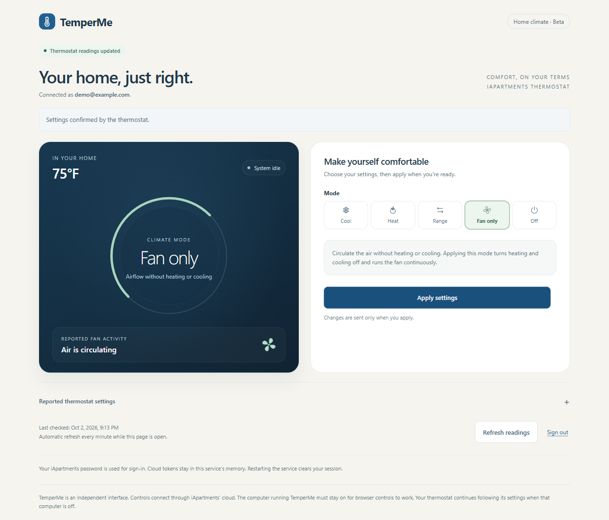

<p align="center">
  
</p>

<p align="center">
  <strong>A small, self-hosted home for your apartment's thermostat.</strong><br>
  Heat, cool, set a comfortable range, or just circulate the air.<br>
  Use your browser. Keep your phone out of it.
</p>

<p align="center">
  <a href="#quick-start">Quick start</a> ·
  <a href="#see-it-in-action">Watch the demo</a> ·
  <a href="docs/deployment.md">LAN setup</a> ·
  <a href="docs/architecture.md">How it works</a> ·
  <a href="SECURITY.md">Privacy & security</a>
</p>

---

TemperMe is an independent browser interface for **iApartments Gen1 thermostats**, initially verified with the **TN100/24/BK**. Run it directly with Node.js for one computer, or use the included Docker and HTTPS configuration to reach it from computers on your LAN.

**Self-hosted interface, cloud-connected controls.** You need an existing iApartments resident account and internet access. TemperMe uses the vendor's undocumented cloud APIs; direct local thermostat control is not implemented. No phone app or Android emulator is needed to run TemperMe.

## See it in action

[](https://github.com/mgelsinger/temperme/raw/refs/heads/main/docs/media/demo.mp4)

**[Download the 25-second MP4 walkthrough](https://github.com/mgelsinger/temperme/raw/refs/heads/main/docs/media/demo.mp4)** · All screenshots and recordings use synthetic demonstration data. They show the real interface without a live account or thermostat.



## Comfortable by design

| Control | What it does |
| --- | --- |
| **Cool / Heat** | Set a target in whole degrees Fahrenheit. |
| **Heat & cool** | Set a lower heating target and upper cooling target, at least 3°F apart. |
| **Fan only** | Turn heating and cooling off and run the fan continuously. Temperature targets stay intact. |
| **Off** | Turn heating and cooling off and return the fan to Auto. Equipment shutdown delays still apply. |
| **Fan Auto / On** | Choose demand-based or continuous airflow while heating or cooling. |
| **Readings & confirmation** | See the current temperature, requested fan setting, reported equipment activity, and whether settings have been confirmed. |



The thermostat keeps managing temperature and equipment timing. Closing the browser or stopping TemperMe leaves its last settings in place. Readings refresh when you click **Refresh readings** or submit settings; they are not a continuous live feed.

## Quick start

Choose one way to run TemperMe. Both use the same interface and resident login.

### On one computer

Install **Node.js 22 or later** and Git, then run:

```sh
git clone https://github.com/mgelsinger/temperme.git
cd temperme
npm ci --ignore-scripts
npm start
```

Open **[http://127.0.0.1:8765](http://127.0.0.1:8765)** and sign in with your iApartments resident account. SMS and authenticator verification codes are supported when requested.

The native service listens only on loopback. Stop it with `Ctrl+C`. On Windows, use `npm.cmd` if PowerShell blocks `npm.ps1`.

### On your LAN with Docker

Install Docker with Compose support. On Windows, Docker Desktop must use Linux containers.

```sh
git clone https://github.com/mgelsinger/temperme.git
cd temperme
cp .env.example .env
```

In PowerShell, use `Copy-Item .env.example .env` instead of `cp` if preferred. Edit `.env` and set `TEMPERME_LAN_IP` to **the server computer's LAN IPv4 address**, not the thermostat's address. The example address is only a placeholder.

```sh
docker compose up -d --build
docker compose ps
```

Your address is `https://YOUR_SERVER_LAN_IP:9443`. Before signing in, **[export and trust your generated HTTPS certificate](docs/deployment.md#trust-https-on-your-computers)** on each client computer. That one-time step is necessary because this private LAN address uses Caddy's local certificate authority.

Keep the server awake and Docker running. Each browser signs in independently. See the **[full LAN guide](docs/deployment.md)** for certificate commands, updates, firewall checks, and changing addresses.

## Your first adjustment

1. Sign in and wait for the assigned thermostat to appear.
2. Choose a mode and, where applicable, a target or temperature range.
3. Select **Apply settings**. A sent command is confirmed only when the thermostat reports matching settings.
4. If confirmation is pending, wait a few seconds and select **Refresh readings**.

Fan settings and actual activity are separate readings. For example, Auto can be selected while the fan is still running during a shutdown delay. A temperature-only adjustment preserves the existing fan setting, including an existing Circulate schedule.

## Privacy without a database

TemperMe does not write resident passwords, cloud tokens, account profiles, or thermostat readings to disk. Authentication state lives in service memory; the browser receives an opaque, HttpOnly session cookie. Application responses use `Cache-Control: no-store`, and the interface does not use browser local storage.

Signing out clears that browser's server session. Restarting the service clears all sessions; reload the page and sign in again afterward. Sessions expire after eight hours of inactivity. Docker preserves Caddy's TLS certificates and keys in its own volumes, not resident credentials.

The default native service is loopback-only. The Docker deployment exposes HTTPS on the configured LAN address, keeps the application port inside Docker, and checks exact request hosts and origins. This deployment is intended for a trusted home LAN. See **[security and data handling](SECURITY.md)** for the full boundaries.

## Compatibility and current limits

| Area | Status |
| --- | --- |
| Hardware | Gen1 built-in thermostat, initially verified on TN100/24/BK. Other models and Gen2 are not verified. |
| Live validation | Resident sign-in, assigned-device reads, and a cooling setpoint change with restoration have been exercised on hardware. |
| Other controls | Heat, Off, heat/cool range, and fan commands follow the observed resident protocol and have automated tests. Physical validation is still limited. |
| Units | Whole degrees Fahrenheit in the interface; Celsius conversion on the wire. Device-reported temperature bounds are enforced. |
| Circulation schedules | Existing settings are preserved unless explicitly changed. Editing timed circulation schedules is not supported. |
| Emergency heat | Displayed when reported, but not offered as a control. |
| Offline operation | The thermostat continues operating, but browser reads and changes require iApartments' cloud. |
| Account setup | Existing resident login with SMS or authenticator MFA. Activation, password resets, and MFA enrollment use the official account flow. |

The APIs are undocumented and may change. TemperMe is not affiliated with or endorsed by iApartments. Device access is limited to the thermostat assigned to the signed-in resident account.

## Help and development

**Can't connect?** Start with the [troubleshooting table](docs/deployment.md#troubleshooting). It covers certificate warnings, sign-in without a thermostat, pending commands, port conflicts, and LAN isolation.

Run the automated suite:

```sh
npm test
```

Tests mock cloud operations and do not operate a real thermostat. They cover temperature conversion and limits, fan command ordering, assigned-device restrictions, MQTT transport, and host/origin/session safeguards. Node may display an experimental VM modules warning from the test harness.

- [Architecture and protocol notes](docs/architecture.md)
- [Contributing and safe bug reports](CONTRIBUTING.md)
- [Security and sensitive information](SECURITY.md)
- [Report a reproducible issue](https://github.com/mgelsinger/temperme/issues)

Built for the simple pleasure of changing the temperature from the computer you are already using.
