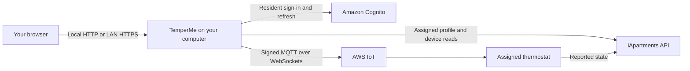

# How TemperMe works

[Back to the README](../README.md)

TemperMe serves one browser page and a small same-origin JSON API. The Node service signs in through the resident account, discovers its assigned thermostat, reads the vendor's reported device state, and sends verified Gen1 commands through the vendor's cloud connection.

The diagram summarizes the application's view of the cloud path. Vendor infrastructure between its services and the thermostat is outside TemperMe's control. Local control was investigated but is not implemented; the application does not connect to a thermostat LAN IP.

## Code map

| File | Responsibility |
| --- | --- |
| [`server.mjs`](../server.mjs) | HTTP routes, resident authentication, in-memory sessions, and request coordination. |
| [`network-config.mjs`](../network-config.mjs) | Bind configuration, exact Host/Origin validation, and session cookie policy. |
| [`iapartments.mjs`](../iapartments.mjs) | Assigned-device reads, Gen1 state mapping, input validation, and command sequencing. |
| [`cloud-mqtt.mjs`](../cloud-mqtt.mjs) | Cognito temporary credentials, signed AWS IoT connection, and restricted shadow publishing. |
| [`public/index.html`](../public/index.html) | Responsive interface, accessible forms, and same-origin API requests. |
| [`compose.yaml`](../compose.yaml) / [`Caddyfile`](../Caddyfile) | Optional LAN HTTPS deployment. |
| [`test/`](../test/) | Offline tests using synthetic fixtures and mocked cloud operations. |

There is no database, frontend build step, telemetry integration, or persistent resident token store. Runtime dependencies are pinned in the lockfile. Caddy's Docker volumes hold TLS material independently of resident sessions.

## Authentication and assignment

The service uses Cognito SRP sign-in and supports SMS or authenticator MFA challenges. SDK storage is replaced with a session-specific in-memory map. The browser receives an opaque local session identifier, not vendor access or refresh tokens.

A resident profile identifies the assigned hub. The device-details response must match that hub and contain exactly one eligible built-in thermostat. Its generation must be explicitly Gen1 without conflicting generation metadata. Commands re-read the resident profile and assigned device before publishing; client requests cannot choose a hub or thing name.

The public Cognito pool, app-client, identity-pool, and cloud endpoint identifiers in source identify the vendor service. They are not resident credentials or administrator access. Authentication and the resident's existing cloud permissions are still required. TemperMe does not change cloud permissions or device policies.

## Reported state and commands

The Gen1 device shadow reports temperatures in Celsius. The UI displays whole degrees Fahrenheit and converts requested targets to one-decimal Celsius values.

| Field | Meaning |
| --- | --- |
| `ct` | Current measured temperature. |
| `tt` | Single-mode target temperature. |
| `htt` / `ctt` | Heating and cooling thresholds in range mode. |
| `tt_min` / `tt_max` | Reported temperature limits. |
| `tm` | Mode: 0 Off, 1 Cool, 2 Heat, 3 Emergency Heat, 4 Heat/Cool. |
| `tf` | Requested fan setting: 0 Auto, 1 On, 2 Circulate. |
| `cf` | Reported fan activity: 0 stopped, 1 running. |
| `cs` | Reported HVAC activity: 0 idle, 1 cooling, 2 heating. |

Writes use separate mode, temperature, and fan messages in that order. Heat/cool range writes send both thresholds together. Fan only combines Off with fan On and leaves all temperature targets unchanged. Off combines Off with fan Auto. If the user has not explicitly changed the fan selector during a temperature adjustment, the fan setting is omitted from the command.

Messages publish only to the assigned thing's shadow-update route through the resident application namespace. A successful MQTT acknowledgment establishes message receipt by the broker. The interface calls a change confirmed only when a subsequent reported-state read matches all requested settings. That confirmation is separate from physical heating, cooling, or fan activity.

## Scope and evidence

The initial hardware target is TN100/24/BK, FCC ID 2AVIHTN12A. The [manufacturer manual](https://fccid.io/2AVIHTN12A/User-Manual/15-TN10024BK-UserMan-US-4736643.pdf) describes its native heating/cooling modes and separate range targets. Protocol investigation included static inspection of a resident application archive and cross-checking public authentication identifiers against the vendor's web client. Running an emulator is not part of the application.

Resident sign-in, device reads, and a reversible cooling setpoint change have been verified on hardware. Other control paths have protocol and mocked-test coverage, with physical validation still limited. The API is undocumented, so support can change independently of this repository.

See [security](../SECURITY.md) for storage and trust boundaries, and [contributing](../CONTRIBUTING.md) for how to report compatibility evidence without exposing an account or device.
